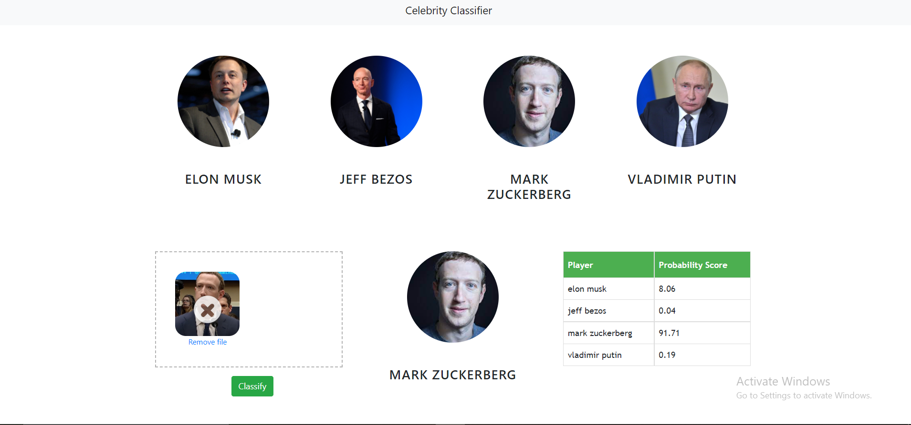

# classifying-celebrities-using-logistic-regression

In this project I will build a web application which can classify famous personalities. I will restrict classification to only 4 people,
1) Elon Musk
2) Jeff Bezos
3) Mark Zuckerberg
4) Vladimir Putin

Here is the folder structure,
* UI : This contains ui website code 
* server: Python flask server
* model: Contains python notebook for model building and google scrapped images used for our model training

Technologies used in this project,
1. Python
2. Numpy and OpenCV for data cleaning
3. Haar cascade for face detection
4. Wavelet transform for feature extraction
5. Matplotlib & Seaborn for data visualization
6. Sklearn for model building
7. Jupyter notebook, visual studio code and pycharm as IDE
8. Python flask for http server
9. HTML/CSS/Javascript for UI

